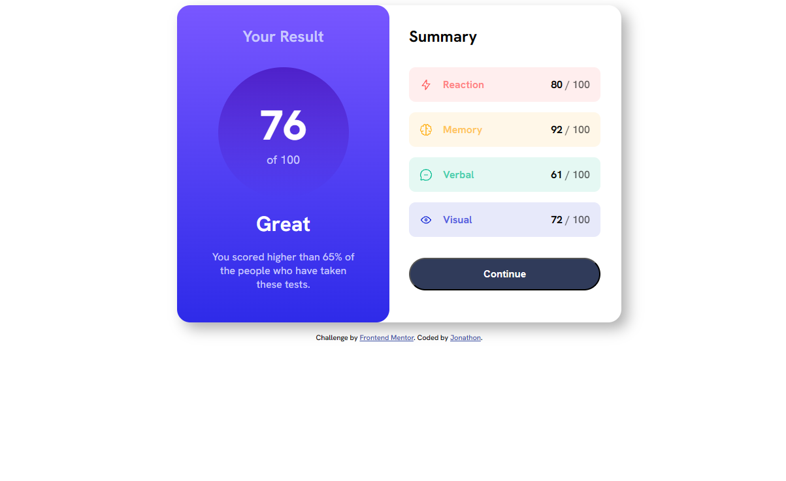

# Frontend Mentor - Results summary component solution

This is a solution to the [Results summary component challenge on Frontend Mentor](https://www.frontendmentor.io/challenges/results-summary-component-CE_K6s0maV). Frontend Mentor challenges help you improve your coding skills by building realistic projects.

## Table of contents

- [Overview](#overview)
  - [Screenshot](#screenshot)
  - [Links](#links)
- [My process](#my-process)
  - [Built with](#built-with)
  - [What I learned](#what-i-learned)
  - [Continued development](#continued-development)

## Overview

I just finished a course on CSS, and now I'm in the stage where I need to get more experience actually building things to improve.

### Screenshot

### Links

- Solution URL: [https://github.com/TGPJonathon/frontend-mentor-result](https://github.com/TGPJonathon/frontend-mentor-result)
- Live Site URL: [https://tgpjonathon.github.io/frontend-mentor-result/](https://tgpjonathon.github.io/frontend-mentor-result/)

## My process

### Built with

- Semantic HTML5 markup
- CSS custom properties
- Flexbox

### What I learned

I felt alot more comfortable with this problem. I wasn't sure if we needed to make this one responsive, so I didn't for this one. But, I think I will in the future for existing problems, because I did not enjoy how the card did not shrink to fit the viewport.

### Continued development

I want to continue learning more about Flexbox & Grid. I also would like to learn the best practices for structuring CSS.
Once I'm comfortable, I'll move on to backend development, getting better at React, and learning some DevOps.
